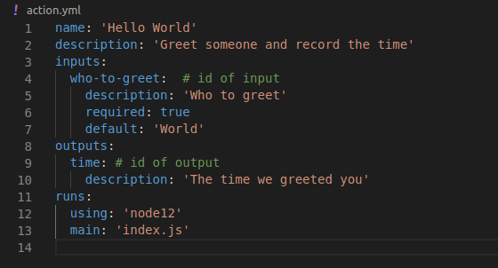
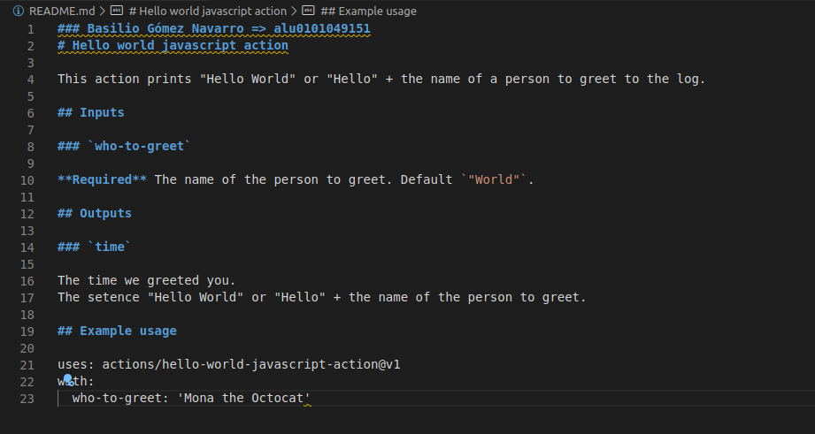
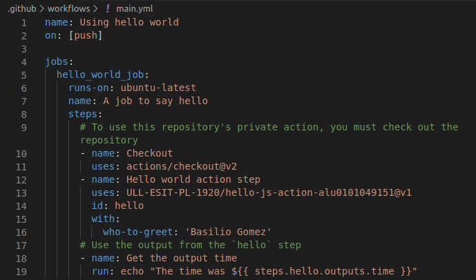
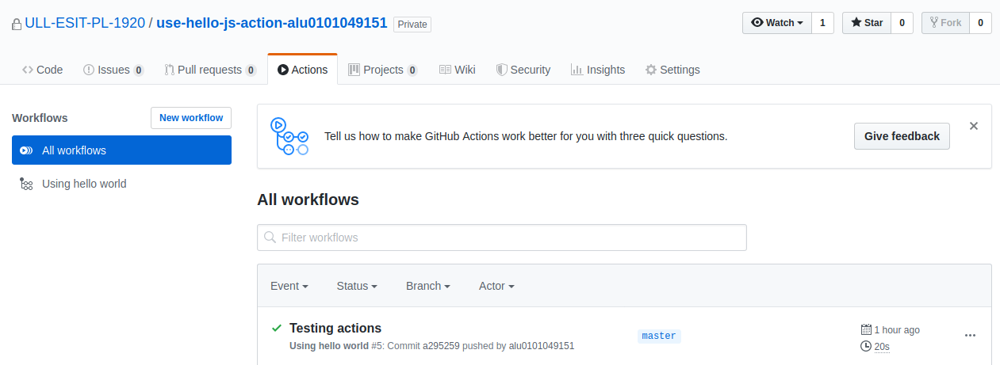

# RETO p10-t2-lexer-generator (Writing a JS GH Action)

## Basilio Gómez Navarro, alu 0101049151

For the development of the assignment, two repositories that are housed within this super-repo have been used:

1. The **hello-js-action-alu0101049151** which contains the code of the action and the `action.yml` file.

2. The **use-hello-js-action-alu0101049151** to test the action and check that works propperly.

## Explanation: repo hello-js-action-alu0101049151

To write the action you must follow the following steps:

1. First you have to set up a **public** repo where you will put the js code of the action.
2. Then you have to init the repo with `npm init -y`.
3. Create a metadata file as shown below:

**VERY IMPORTANT:** The name of the file must be: **action.yml**

4. Add actions toolkit packages running the following on your repo directory.
`npm install @actions/core`
`npm install @actions/github`
5. Write the action code. In this case the JS code of the action is the one shown below:

```javascript
const core = require("@actions/core");
const github = require("@actions/github");

try {
  // `who-to-greet` input defined in action metadata file
  const nameToGreet = core.getInput("who-to-greet");
  console.log(`Hello ${nameToGreet}!`);
  const time = new Date().toTimeString();
  core.setOutput("time", time);
  // Get the JSON webhook payload for the event that triggered the workflow
  const payload = JSON.stringify(github.context.payload, undefined, 2);
  console.log(`The event payload: ${payload}`);
} catch (error) {
  core.setFailed(error.message);
}
```
**Important:** We have to store the code in a file called `index.js`

6. Then we have to create the readme of the action inside our action-code-repo:


7. By last, commit, tag and push your action to GitHub. To do that, is important to commit the following:
  
    1. The `action.yml` file.
    2. `index.js`
    3. `node_modules`
    4. `package.json`
    5. `package-lock.json`
    6. `README.md`

**IMPORTANT: DON'T FORGET TO PUSH THE `node_modules` DIRECTORY**
Once we have done this, the next step is testing on the other repo.

## Explanation: repo use-hello-js-action-alu0101049151

1. To test the action, we have to create another reposotory. In our case it well be the `use-hello-js-action-alu0101049151` as shown above.

2. Create a `.github` directory.

3. Inside this directory, create another called "workflows". **Is very important that the name be 'workflows'**.

4. Inside the `workflows` directory, create a file "main.yml" where we'll put the workflow code specifying the action that we want to use as shown below:


5. Finally, add, commit and push all to the repo and check the **"actions"** section of the repo:


